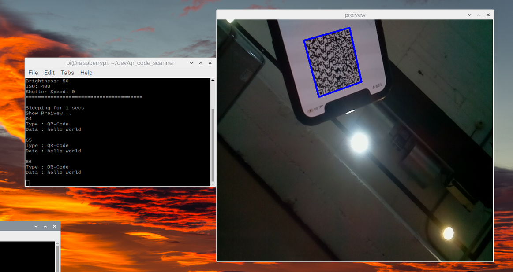

# qr_code_scanner
The QR Code scanner with CSI camera for Raspberry Pi

## Pre-request
* OpenCV
* RaspiCam
* Zbar

 __Note that Build OpenCV first then build RaspiCam to generate `RaspiCam_Cv` class. For more info, please check [here](https://www.uco.es/investiga/grupos/ava/node/40)__
 
## Compile

* If OpenCV is installed by `sudo apt-get install libopencv-dev` 
```
g++ -o main main.cpp -lraspicam -lraspicam_cv -lzbar `pkg-config --cflags --libs /usr/lib/arm-linux-gnueabihf/pkgconfig/opencv4.pc`
```

## Result


